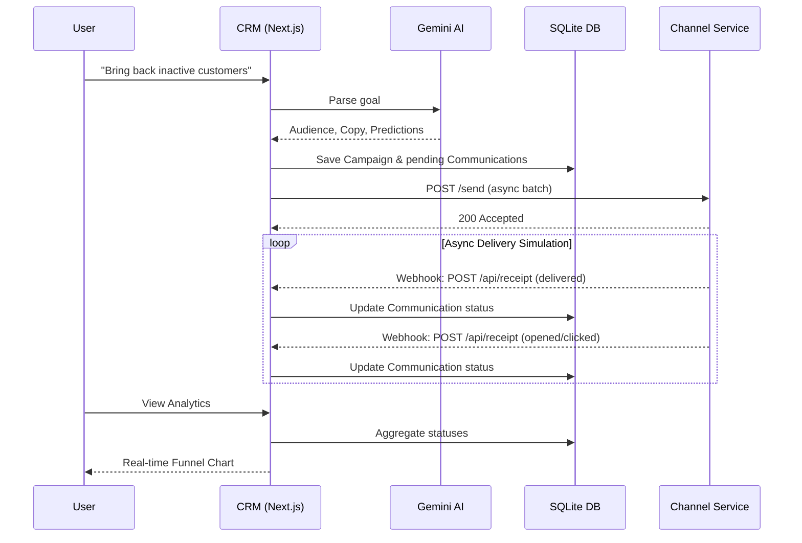

# AI-Native Mini CRM

An AI-native campaign management platform built for marketing teams. Instead of traditional list-building, this CRM leverages natural language to build audiences, craft campaigns, and predict outcomes using AI.

## Architecture

This project is split into two connected services:
1. **Mini CRM (Next.js)**: The core AI Copilot, UI, and Database.
2. **Channel Service (Express)**: An external stubbed provider (like Twilio or SendGrid) that accepts messages and asynchronously simulates delivery/engagement events back to the CRM via webhooks.

### Flow Diagram



## Setup Instructions

### 1. Environment Setup
Create a `.env` file in the root of the project:
```env
GEMINI_API_KEY="your-google-gemini-api-key"
```

### 2. Install and Seed the Database
```bash
npm install
npx prisma db push
npx prisma db seed
```
*(This will populate 500 customers and 1500 realistic orders).*

### 3. Start the Next.js CRM
```bash
npm run dev
```
The CRM will be available at `http://localhost:3000`.

### 4. Start the Channel Service
In a **separate terminal window**, start the external delivery simulator:
```bash
cd channel-service
npm install
npm start
```
The Channel Service will run on `http://localhost:4000`.

---

## Production Scale Assumptions

The current implementation is designed as an MVP for local execution. To handle production scale (e.g., 100k+ customers, 10k campaigns/month), the following architectural changes should be made:

* **Database**: Migrate from SQLite to **PostgreSQL** to handle concurrent writes (especially from high-volume webhook receipts) and complex segmentation queries.
* **Queue System**: Implement a message broker like **Kafka**, **RabbitMQ**, or AWS **SQS**.
  * When a campaign launches, rather than firing thousands of `fetch` calls in an async loop, the CRM should push a single "Launch Campaign" event to a queue.
* **Worker Services**: Spin up dedicated background worker nodes (e.g., using BullMQ or Celery) that consume the queue, chunk the audience into manageable batches, and handle the API rate limits when sending data to the actual external Channel providers (Twilio/SendGrid).
* **Webhook Ingestion**: The `/api/receipt` webhook endpoint should drop incoming events directly into a high-throughput queue or stream (like Kafka) rather than executing synchronous database updates. Background consumers would then batch-update the database to prevent locking.
