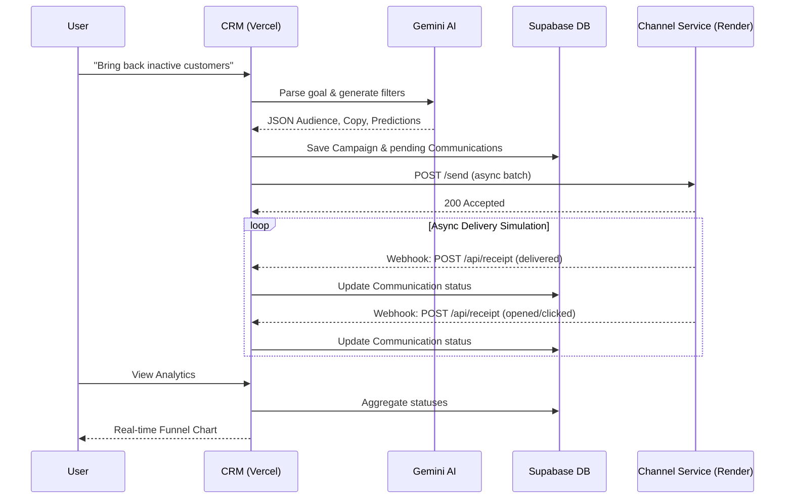

# AI-Native Mini CRM (XENO.EXE)

An AI-native campaign management platform built for marketing teams. Instead of traditional list-building, this CRM leverages natural language to build audiences, craft campaigns, and predict outcomes using AI.

## Architecture

This project is split into two connected services deployed across the cloud:
1. **Core CRM (Next.js)**: The main AI Copilot, UI, and API. Hosted on **Vercel** and connected to a **Supabase PostgreSQL** database via Prisma.
2. **Channel Service (Express)**: An external stubbed provider that accepts messages and asynchronously simulates real-world delivery/engagement events back to the CRM via webhooks. Hosted independently on **Render**.

### Flow Diagram



## Local Setup Instructions

### 1. Environment Setup
Create a `.env` file in the root of the project:
```env
GEMINI_API_KEY="your-google-gemini-api-key"
DATABASE_URL="your-supabase-connection-pooler-url?pgbouncer=true"
```

### 2. Install and Seed the Database
```bash
npm install
npx prisma db push
npx prisma db seed
```
*(This will populate 500 customers and 1500 realistic orders into your Postgres database).*

### 3. Start the Next.js CRM
```bash
npm run dev
```
The CRM will be available at `http://localhost:3000`.

### 4. Start the Channel Service
In a **separate terminal window**, start the external delivery simulator:
```bash
cd channel-service
npm install
npm start
```
The Channel Service will run on `http://localhost:4000`.

---

## Production Deployments

The live application is fully deployed across the following services:
- **Frontend & Core APIs**: Deployed on [Vercel](https://vercel.com).
- **Database**: PostgreSQL hosted on [Supabase](https://supabase.com), utilizing an IPv4 connection pooler for serverless compatibility.
- **Webhook Channel Service**: Node.js Express server running 24/7 on [Render](https://render.com).

*(Note: In Vercel, the `CHANNEL_SERVICE_URL` environment variable connects the Next.js app to Render. In Render, the `CRM_WEBHOOK_URL` connects the simulation back to Vercel.)*

---

## Production Scale Assumptions

While this project successfully migrated to PostgreSQL to support concurrent webhook writes and serverless deployments, the following architectural changes should be made to handle true enterprise scale (e.g., 10M+ customers):

* **Queue System**: Implement a message broker like **Kafka**, **RabbitMQ**, or AWS **SQS**.
  * When a campaign launches, rather than firing thousands of `fetch` calls in an async loop directly from the Vercel edge, the CRM should push a single "Launch Campaign" event to a queue.
* **Worker Services**: Spin up dedicated background worker nodes (e.g., using BullMQ or Celery) that consume the queue, chunk the audience into manageable batches, and handle the API rate limits when sending data to the actual external Channel providers (Twilio/SendGrid).
* **Webhook Ingestion**: The `/api/receipt` webhook endpoint should drop incoming events directly into a high-throughput queue or stream (like Kafka) rather than executing synchronous database updates. Background consumers would then batch-update the database to prevent locking and connection exhaustion.
